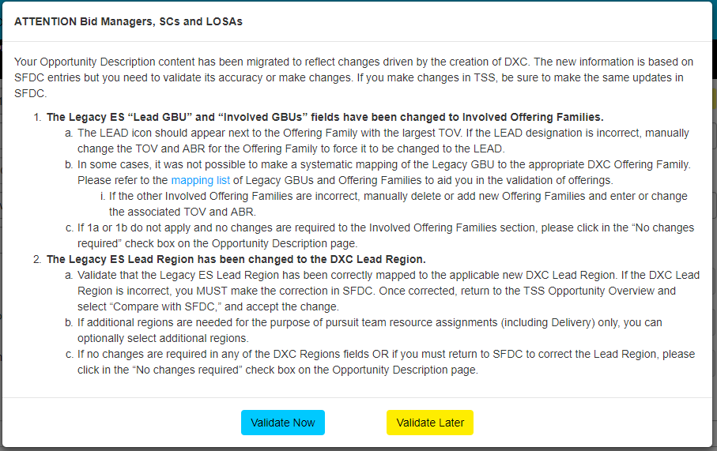

# [返回目录](../content.md)

## localStorage和sessionStorage结合使用的案例

客户需求如下：
>1. 系统中仅有Bid Manager和Solution Consultant这两个Key Role，进入到Oppty页面后，才会有'Validate'的相关操作，其他role无法直接看到这个Dialog(除非加入到Oppty对应的上面的Key Role中)。
>2. 系统中不止一个人是在Key Role里面，所以任何一个在Key Role里面的人，一旦进入到Oppty，若该Oppty没有validate，均强制弹出该dialog。
>3. 该dialog一旦弹出，有'Validate Now'和'Validate Later'两种选择。
>4. 选择'Validate Later'，在下次打开该Oppty前，可以正常访问该Oppty下的其他section内容；如果浏览器关闭(也可能只是关闭了tab)，则下次dialog会强制弹出，并且只有'Validate Now'一种选择
>5. 选择'Validate Now'，如果当前section不是'Opportunity Description'，则首先会强制导航到该section。接下来要做的事情就是在该section的页面有两部分的内容需要check，check一旦满足条件后，会自动往后端发送validated请求，此时validate所有操作结束。

>上述第五条，因为也考虑到选择'Validate Now'后，并未去页check相应字段(可能直接手动刷新页面，或者遇关机情况)。但是因为此时并未向后端发起validated请求，所以下一次进入该oppty后，将会继续从第一步流程开始往后走，直至validate结束。


以OPP-01234567890为例，下面列出了所有的case：
场景 | OPP-1234567890_later |  OPP-1234567890_attention
---  | --- | ---
 | localStorage |  sessionStorage
 首次进入 | null | null
 第一次弹出dialog后 | null | 1st
 选择'Validate Later'后 | 1st | 1st
 点过later，关闭浏览器后再次进入 | 1st | null
 validated过后 | null | null

参考设计图：


关于是否显示dialog的关键实现代码如下：
```js
function showAttention() {
  if (self.isNewCreated() === false 
    && self.state.isCoreRoleValidated() === false 
    && self.state.validateNowClicked() === false) {
    var attention = self.opptyID() + "_attention";
    var later = self.opptyID() + "_later";
    var attentionSessionVal = sessionStorage.getItem(attention);
    var laterLocalVal = localStorage.getItem(later);

    if (!attentionSessionVal && !laterLocalVal) {
      // case #1: first time enter
      if (isOpptyDescptionPage()) {
        showAttentionModal();
        sessionStorage.setItem(attention, "1st");
        self.state.firstAttention(true);
      }
    } else if (laterLocalVal === "1st" && attentionSessionVal === null) {
      // case #3: re-open browser again or open a new tab
      if (isOpptyDescptionPage()) {
        self.state.firstAttention(false);
        self.state.validateLaterClicked(true);
        showAttentionModal();
      }
    } else if (laterLocalVal === "1st" && attentionSessionVal === "1st") {
      // case #2: refresh browser
      self.state.validateLaterClicked(true);
      self.state.firstAttention(true);
    } else {
      if (isOpptyDescptionPage()) {
        showAttentionModal();
      }                        
    }

    checkBrowserSupportStorage();
  }

  function isOpptyDescptionPage() {
    if (self.sid() !== "0201") {
      self.sid("0201");
      return false;
    }
    return true;
  }

  function showAttentionModal() {
    $('#core-role-modal').modal('show');
  }
  
}
```

而两个按钮实际做的事情很少：
```js
self.validateLater = function () {
  $('#core-role-modal').modal('hide');

  var attention = self.opptyID() + "_attention";
  var later = self.opptyID() + "_later";

  if (sessionStorage.getItem(attention) === "1st" && !localStorage.getItem(later)) {
    window.localStorage.setItem(later, "1st");
  } else {
    // todo                    
  }
  self.state.validateLaterClicked(true);
};

self.validateNow = function () {
  self.state.validateNowClicked(true);
};

self.validateAttention = function () {
  sp.app.workingDialog.show('');
  api.TSSWebService.doValidateAttention(self.opptyID()).then(function (data, status, xhr) {
    if (data === undefined && xhr.status < 400) {
      var attention = self.opptyID() + "_attention";
      var later = self.opptyID() + "_later";

      sessionStorage.removeItem(attention);
      localStorage.removeItem(later);
      setTimeout(function () {
        sp.app.workingDialog.hide('');
        self.state.isCoreRoleValidated(true);
      }, 2000);
    } else {
      sp.app.workingDialog.hide('');
      errorHandler(data);
    }                    
  });
};
```