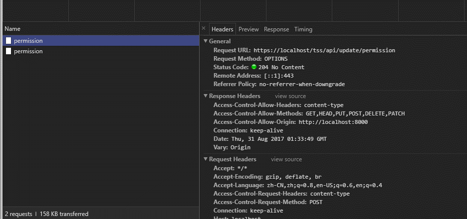

# [返回目录](../content.md)

## 跨域问题

通常一个website都会去访问外部资源，因为各浏览器厂商的均有对此通信原则有一套跨域访问限制的实现，所以一旦这种情况发生，就可导致跨域的产生。在了解跨域之前，需要先了解一下，什么是“浏览器的同源策略”

## 浏览器同源策略

什么是一个源？
如果协议，端口和域名对于两个端（可以是浏览器端和服务器端的任意组合），则认为他们是同源的。

以http://store.company.com/dir/page.html为例
TEST
1. http://store.company.com/dir2/other.html yes
2. http://store.company.com/dir/inner/another.html yes
3. https://store.company.com/secure.html fail (diff protocol)
4. http://store.company.com:81/dir/etc.html fail (diff port)
5. http://news.company.com/dir/other.html (diff host)

其中IE有一些例外：

* 上面的第5中情况，因为域名一样，IE认为这个是高度互信的域名，是不遵守同源策略的限制的
* 端口号不同，也就是上面的第四种情况，IE则认为他们是同源的


参考文档：https://developer.mozilla.org/zh-CN/docs/Web/Security/Same-origin_policy

## 跨域访问策略


## 跨域资源共享标准

允许在下列场景中使用跨域http请求：
* 由XMLHttpRequest或Fetch发起的HTTP请求
* Web字体(CSS中使用@font-face使用跨域字体资源)
* WebGL贴图
* 使用drawImage将Images/video画面绘制到canvas
* 样式表
* Scripts

## 简单请求

某些请求不会触发CORS预检请求。这样的请求成为简单请求。

```http
Access-Control-Allow-Origin: http://foo.example
Access-Control-Allow-Origin: *
```

## 预检请求

需预检的请求必须首先使用OPTIONS方法发起一个预检请求到服务器，从而得知该服务器是否允许实际请求。预检请求可以避免跨域请求对服务器的用户数据产生未预期的影响。

当请求满足下描述的任一条件是，即首先发送预检请求：

* 使用了任一HTTP方法(PUT, DELETE, CONNECT, TRACE, PATH)
* 认为设置了[对CORS安全的首部字段集合]之外的其他首部字段.
	1. Accept
	2. Accept-Languague
	3. Content-Language
	4. Content-Type(Content-Type 实体头部用于指示资源的MIME类型media type)
	5. DPR
	6. Downlink
	7. Save-Data
	8. Viewport-Width
	9. Width
* Content-Type的值不属于下列之一
	1. application/x-www.form-urlencoded
	2. multipart/form-data
	3. text/plain

下面的请求就需要执行预检请求
```js
var invocation = new XMLHttpRequest();
var url = 'http://bar.other/resources/post-here/';
var body = '<?xml version="1.0"?><person><name>Arun</name></person>';
    
function callOtherDomain(){
  if(invocation)
    {
      invocation.open('POST', url, true);
      invocation.setRequestHeader('X-PINGOTHER', 'pingpong');
      invocation.setRequestHeader('Content-Type', 'application/xml');
      invocation.onreadystatechange = handler;
      invocation.send(body); 
    }
}
```

预检请求之后会发送实际请求。所以应该知道为什么浏览器中监测网络时，会发现一个https请求可能有两次发送，第一次OPTIONS并不是所谓的请求证书之类的，二是一次预检请求的发送，如果这个时候出现了404，则表示你提交的request有问题，要么就是后端没有对应的路由信息。

## 跨域的限制范围

* 浏览器端的存储机制(Cookie, localStorage, sessionStorage等)将不能直接读取
* DOM的操作
* AJAX请求受限

## 解决ajax跨域问题的方案

* 服务端采用JSONP提供服务
* CORS允许跨域
* 通过代理访问的方式

一般如果在浏览器出现了跨域问题，可以在Console中很容易就能发现，会出现类似如下错误：

```http
No 'Access-Control-Allow-Origin' header is present on the requested 
```

## 允许CORS

这个时候一般是前端app访问后端服务器，所以需要后端来允许跨域，不同的后端语言对跨域的写法不同，但是一般就是加上允许跨域的请求头：

```js
response.header('Access-Control-Allow-Origin', '*');
response.header('Access-Control-Allow-Methods', 'GET,PUT,POST,DELETE,OPTIONS');
```

nodejs中更加简单，cors相当于中间件

```js
var cors = require('cors')
var app = express()

app.use(cors())
```

koa2也非常类似
```js
const Koa = require('koa')
const cors = require('kcors')

// put it after bodyParser
app.use(cors())
```

其他的后端语言，如.net, java参考[这里](http://www.jianshu.com/p/82b82d5dd1ea)

## 代理的方式

代理的方式，可以认为是你的请求不是发送到了目标服务器，而是先发送给了代理服务器，再由代理服务器将真正的请求发送给目标服务器，目标服务器将请求返回给代理服务器，代理服务器可能做了一层加工，将最后的数据再返回给你。

[8 行 Node.js 代码实现代理服务器](http://www.jianshu.com/p/50d82333b22a)

## 研究跨域问题的新发现

在jquery ajax的文档中，关于contentType有这样的说明

```text
Note: For cross-domain requests, setting the content type to anything other than application/x-www-form-urlencoded, multipart/form-data, or text/plain will trigger the browser to send a preflight OPTIONS request to the server.
```

而在前段开发中，我们是要使用`application/json`这种文档类型的，所以一旦指定这样的请求头，那么就会触发浏览器端的预检请求。以一个常规的POST请求为例，POST之前会发送一个请求方法为OPTIONS的预检请求。第二个请求才是真正的POST请求。



问题是：koa框架中，我们只会写对应的POST请求的对应路由，而OPTIONS请求是没有对应的路由的，所以如果没有正常启用cors就会导致预检请求出错。

在没有启用类似kcors这种中间件前，我们一般为了方便都是这样来启用跨域的：

```js
ctx.set('Access-Control-Allow-Origin', '*')
ctx.set('Access-Control-Allow-Methods', '*')
ctx.set('Access-Control-Request-Headers', '*')
```

简简单单几行代码似乎就能搞定一切了，没错！你这样确实启用了跨域，也允许了所有的请求头，包括'OPTIONS'，然而试验一把你会发现：跨域问题是解决了，但是POST请求却返回了404。

```error
Response for preflight has invalid HTTP status code 404
```

起初以为是[koa-bodyParser](https://github.com/koajs/bodyparser/blob/master/index.js)是不是没有处理这样的请求，通过debug发现，它确实启用了'application/json'来处理json数据，但是预检请求还没有发送真实的数据，所以问题也不是在这里。

所以，常规思路，再用API调试工具(postman)来call一下api，看是否可以正常拿到数据。惊奇的发现，postman是完全可以拿到数据的。既然postman可以，而前端的ajax框架出现了问题，我们第一时间都会怀疑是框架的问题，我用的[vue-resource](https://github.com/pagekit/vue-resource)，然后通过拦截器，POST请求全部使用'application/json'格式传输数据。

```js
// update data
this.$http.post('update/permission', this.permission).then((response) => {
	console.log(response)
	this.permission[part] = response.body[part]
})

// vue-resource interceptor
Vue.http.interceptors.push(function (request, next) {
  this.$store.state.showWokingDialog = true
  if (request.method === 'POST') {
    request.headers['Content-Type'] = 'application/json'
  }
  next(function (response) {
    this.$store.state.showWokingDialog = false
  })
})

```

就这样折腾了好久，还是没有得到想象中的结果！
但是，通过debug官方的代码的时候，发现都没有处理OPTIONS这种请求。


