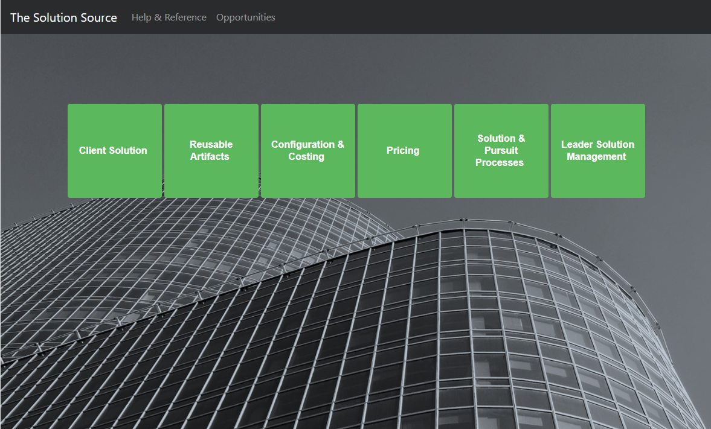

# [返回目录](../content.md)

## flex布局

前端布局比较流行的有网格布局(grid layout)，广为流传的Bootstrap更是开辟了网格布局的先河，而且已经是各种大中小型项目必不可少的一部分。

我们自己项目就有用到Boostrap，项目延伸出的几个子项目全部沿用我们现有的前后端技术。前端技术栈有：requirejs、knockoutjs、jquery、Bootstrap,还有一些大大小小的工具库，组件通过ko来实现封装，以AMD方式组装，暴露给其他组件使用。在一定程度上，组件化的粒度很小，如果有两处代码一模一样，基本都会组件化它。

还是来讲讲flex布局，源于阮一峰老师的一片文章，但是一开头就感觉有点误导，最后还是查看了他的参考[英文文档](https://css-tricks.com/snippets/css/a-guide-to-flexbox/)，说的比较详细些。

先来个案例

为了让中间那一排绿色的盒子处于中间，我们只需要对container添加`justify-content: center;`，垂直方向居中是用：`align-items: center;`

```html
<div id="ss-portal-container">
  <div class="ss-outlink" v-for="link in links" :key="link.title">
  <div class="ss-outlink-item">
    <b-dropdown :text="link.title" variant="success">
    <b-dropdown-item v-for="item in link.items" :link="true" :to="item.link" :key="item.title">{{item.title}}</b-dropdown-item>
    </b-dropdown>
  </div>
  </div>
</div>
```

```css
#ss-portal-container {
  border: none;
  height: 500px;
  width: 100%;
  margin: 0 auto;
  background-color: transparent;
  box-sizing: border-box;
  display: inline-flex;
  flex-direction: row;
  justify-content: center;
  align-items: center;
  align-content: center;
}
.ss-outlink {
  height: 160px;
  width: 160px;
  box-sizing: border-box;
  padding: 2px;
}
```

效果图：
