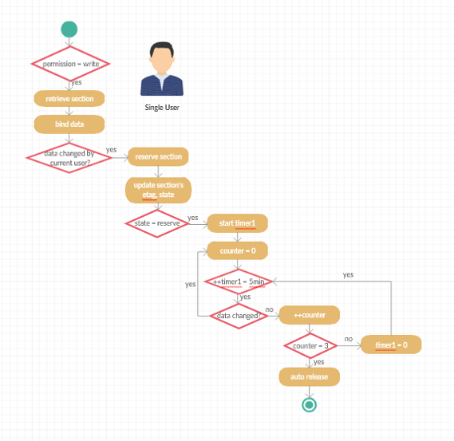

# [返回目录](../content.md)

## 二、Release(checkin), Reserve(checkout), Auto-Save实现详解

### 摘要
>1. release, reserve, auto-save均为原子操作，是由前端发起的http请求，通过传递不同的http header来标识，通过ETag来处理冲突(ETag在后端实质为document下section的revision数量)
>2. 用户访问一个document的section，如果对此section有write权限，则在用户第一次编辑操作开始后，会自动由前端发起一次reserve请求，请求被后端接收后，会在db中将该section的状态置为reserve，且记录当前的editor；read权限将不会触发reserve操作；如果同时有两个或多个用户同时进入且有write权限，先修改者会成功，后修改者会先提示冲突，refresh页面后会提示该页面已被其他人修改。 
>3. 用户修改完成后，可以单击导航的统一保存按钮(包括save, GoToNextAfterSave, GoToPrevAfterSave)执行保存(Release)。

>Tips
为了防止他人长期reserve某个section，有如下措施将会被手动或者自动触发，从而释放文档的锁定
>> 1. Admin组, SuperUser组，这些组的人将会有Force Release权限，强制将section的状态改为release。reserve改section的用户数据可能会丢失(auto-save会减少这种数据丢失)
>> 2. auto-save是用户在reserve某一个section之后，没有任何操作开始计时，若计时器5min中内无任何修改或保存操作，将会执行第一次auto-save。此时section状态为auto-save(注意不是release)
>> 3. 我们会对每5min无保存操作做计数，如果中途有一次修改，计数器将归为零，等待下一个5min。如果计数器累计有3次无任何修改或者保存操作，将会触发另外一个操作(auto-release)，此时才会将section的状态置为release
>> 4. 在任何一次reserve，auto-save过程当中，一旦通过save按钮执行了save操作，所有的计时器、计数器归为零
>> 5. 考虑到用户在reserve一个section后将页面进行手动刷新，因为在http header得到该section为reserve状态，所以，这种情况下，需要自动开启计时器和无操作后开启计数器。

### 单用户操作的活动图大致如下：

### 多用户
如果是多用户，会有多个方面的状态过滤。这里就不补充图，仅以文字说明如下：

> 1. 第一层过滤是，权限必须是write，否则不能完成reserve操作
> 2. 如果已被其他用户reserve，则该用户不能完成reserve后续的所有操作
> 3. 如果当前用户已经完成对section的reserve，而此时有Super User将其Force Release，那么section的状态由reserve改写成discard。当前用户再次向后端发起对该section的请求时，将会提示数据已被他人强制改写，当前数据可能已丢失。
